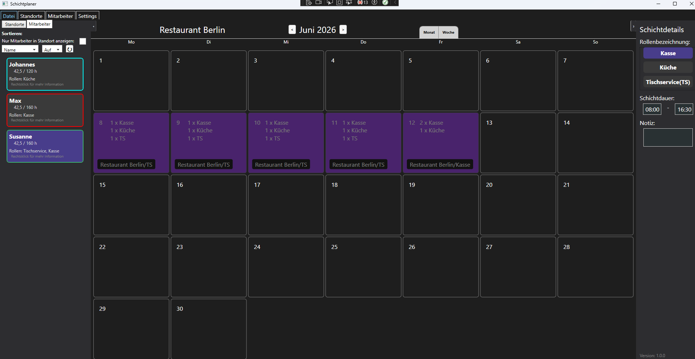

# Schichtplaner

Dienstplan- und Schichtplanungssoftware für kleine Einrichtungen, Restaurants und ähnliche Betriebe.

Eine Windows-Desktopanwendung zum Erstellen, Verwalten und Exportieren von Dienstplänen.

Entwickelt für Personen, die Dienstpläne erstellen und diese anschließend als PDF oder CSV an Mitarbeitende und die Verwaltung weitergeben.

## Typischer Ablauf

1. Standorte und Positionen anlegen
2. Mitarbeitende erstellen und verwalten
3. Schichten und Abwesenheiten eintragen
4. Personalbesetzung und Arbeitszeiten überprüfen
5. Dienstpläne als PDF oder CSV exportieren
6. Dienstpläne an Mitarbeitende und Verwaltung verteilen

## Funktionen

- Monatliche Dienstplanung
- Mitarbeitendenverwaltung
- Abwesenheitsverwaltung
- PDF-Export pro Mitarbeitendem
- PDF-Export pro Standort
- CSV-Export
- Optionale automatische Berücksichtigung gesetzlicher Mindestpausen
- Schichtübersicht und Statistiken
- Frei definierbare Standorte und Positionen
- Feiertage nach Bundesland 

Hinweis: 
Die automatische Pausenberechnung dient als Unterstützung.
Die Verantwortung für die Einhaltung der geltenden arbeitsrechtlichen Vorschriften liegt beim Anwender.

## Screenshots

#Hauptfenster



## Download

Die aktuelle Version steht auf der Releases-Seite zum Download bereit.

## Systemvoraussetzungen

- Windows 10 oder Windows 11

## Projekt selbst kompilieren

Benötigt werden:

- Visual Studio 2022
- .NET 8 SDK

Repository klonen:

```bash
git clone https://github.com/Poydran/Schichtplaner.git
```

Anschließend die Lösung öffnen:

```text
Shiftplanner.sln
```

Das Projekt in Visual Studio erstellen und ausführen.

## Drittanbieter-Software

Diese Anwendung verwendet Open-Source-Software von Drittanbietern.

Weitere Informationen befinden sich in der Datei `THIRD-PARTY-NOTICES.txt` .

## Copyright

Copyright © 2026 Fabian Teufel

## License

Dieses Projekt steht unter der GNU General Public License v3.0 (GPL-3.0).
Weitere Informationen sind in der Datei `LICENSE` enthalten.